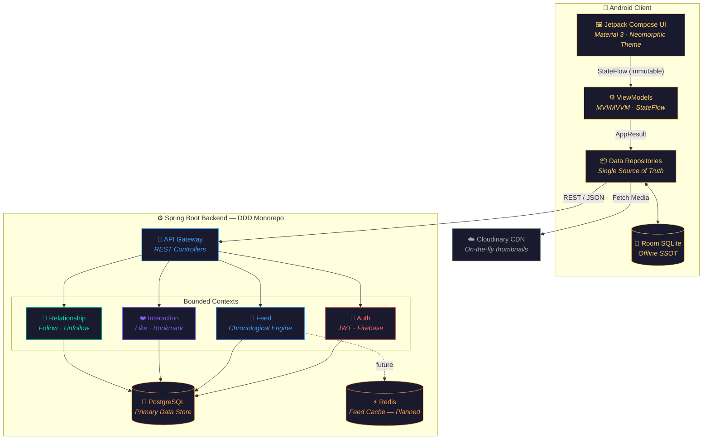
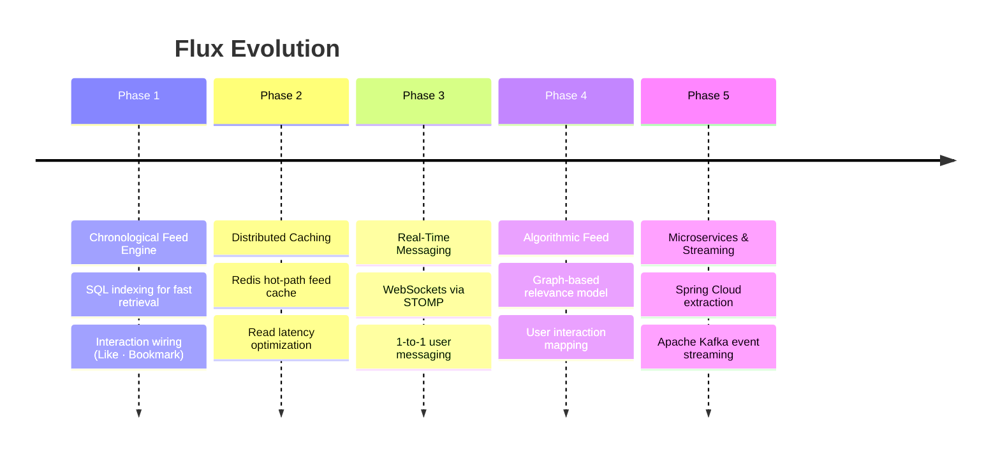

# ⚡ Flux — Distributed Scalable Feed Engine


> A full-stack engineering case study demonstrating a scalable, distributed news feed system — native Android client built with Jetpack Compose and a backend engineered with Kotlin + Spring Boot, strictly adhering to Domain-Driven Design (DDD) principles.

---

## 🚧 Problem Statement

Modern social news feeds face significant challenges with high-frequency read/write ratios, eventual consistency, and media optimization. Monolithic architectures often bottleneck under these conditions.

**Flux** addresses these by implementing:

| Challenge | Solution |
|---|---|
| Scalability bottlenecks | Isolated bounded contexts (Auth, Feed, Interaction, Relationship) |
| Network retry failures | Idempotent UPSERT logic for high-frequency actions |
| Heavy media delivery | Cloudinary CDN with on-the-fly thumbnail generation |
| Network volatility on client | Cache-Then-Network strategy via Room Database |

---

## 📐 Architecture Overview



---

## 🗂️ Module Structure

### Android Client
```
feature/
├── auth/               # Login · SignUp · JWT token management
│   ├── data/           #   remote (AuthApi, DTOs) · local (UserDao, UserEntity)
│   ├── domain/         #   User model · AuthRepository interface
│   └── presentation/   #   AuthViewModel · LoginScreen · SignUpScreen
│
├── feed/               # Post listing · FeedViewModel
│   ├── data/           #   FeedApi · PostDto · FeedRepositoryImpl
│   ├── domain/         #   Post model · FeedRepository interface
│   └── presentation/   #   FeedScreen · FeedViewModel
│
├── interaction/        # Like · Bookmark
│   ├── data/           #   InteractionApi · InteractionDao
│   ├── domain/         #   InteractionRepository interface
│   └── presentation/   #   InteractionBar component
│
└── relationship/       # Follow · Unfollow · Connections
    ├── data/           #   RelationshipApi · FollowDao · FollowWorker (WorkManager)
    ├── domain/         #   RelationshipUser · ProfileStats models
    └── presentation/   #   ProfileScreen · ConnectionScreen · ProfileViewModel

core/
├── database/           # FluxDatabase · Converters
├── datastore/          # TokenManager (DataStore)
├── di/                 # AppModule · NetworkModule (Hilt)
├── navigation/         # Routes
├── network/            # AuthInterceptor · Result sealed class
└── ui/theme/           # Color · Type · Theme (Cosmic Ambient)
```

### Spring Boot Backend
```
server/
├── auth/               # AuthController · AuthService · JWT filter
├── feed/               # FeedController · FeedService · Post + PostAttachment
├── interaction/        # InteractionController · InteractionService · InteractionHelper
├── relationship/       # RelationshipController · FollowService · Follows model
└── config/             # SecurityConfig · CloudinaryConfig · JwtAuthFilter
```

---

## 🛠 Tech Stack

### 📱 Android Client

| Layer | Technology |
|---|---|
| Language | Kotlin |
| UI | Jetpack Compose · Material 3 · Custom Neomorphic Theme |
| Architecture | Clean Architecture · MVI/MVVM · SSOT |
| Concurrency | Kotlin Coroutines · Flow |
| Local DB | Room Database |
| Networking | Retrofit · OkHttp |
| Background | WorkManager (pending follow sync) |
| DI | Hilt |

### ⚙️ Backend

| Layer | Technology |
|---|---|
| Language | Kotlin |
| Framework | Spring Boot |
| Architecture | Domain-Driven Design (DDD) — 4 bounded contexts |
| Database | PostgreSQL |
| Media | Cloudinary (upload pipeline + CDN transforms) |
| Auth / Push | Firebase Auth · Firebase Cloud Messaging (FCM) |
| Cache | Redis *(planned)* |

---

## 📱 Mobile System Design Highlights

Inspired by **Manuel Vicente Vivo's "Mobile System Design"**:

**🔄 Offline Sync & SSOT**
The `ProfileRepository` enforces a strict **Cache-Then-Network** strategy. Room DB serves as the single source of truth — the UI renders instantly from cache while a background sync refreshes stale data silently.

**➡️ Unidirectional Data Flow (UDF)**
UI components are fully stateless. All events flow through ViewModels, which expose immutable `StateFlow` streams. This guarantees consistent UI states even during complex async retries.

**⚡ Idempotent Client-Server Communication**
Follow/Unfollow API requests are structured to be safely retried without causing duplicate backend states. Offline actions are queued via `WorkManager` (`FollowWorker`) and synced when connectivity resumes.

---

## 📊 Project Status

### ✅ Completed

- [x] **Core DDD Architecture** — Monorepo with isolated modules (`auth`, `feed`, `interaction`, `relationship`)
- [x] **Client Theming** — "Cosmic Ambient" custom design system using Material 3
- [x] **Relationship Module** — Follow/Unfollow with backend idempotency + WorkManager sync
- [x] **Offline-First Profile** — `ProfileRepository` with Room DB caching + network fallback
- [x] **Cloudinary Integration** — Backend media upload pipeline + edge thumbnail generation
- [x] **UI Screens** — Login, Dynamic Profile (View/Edit modes), Connections List

### ⏳ Pending

- [ ] **Feed Home Page UI** — "Fluid Timeline" with asymmetric visual clusters for the main feed
- [ ] **Interaction Wiring** — Connect Like/Bookmark from UI to the backend interaction module
- [ ] **Chronological Feed Engine** — SQL-based feed generation with proper DB indexing

---

## 🚀 Future Roadmap



---

## 🤝 Contributing

This is an engineering case study. Issues and PRs are welcome for discussion of architectural decisions.

---

*Developed by [@neerajsahu14](https://github.com/neerajsahu14)*
