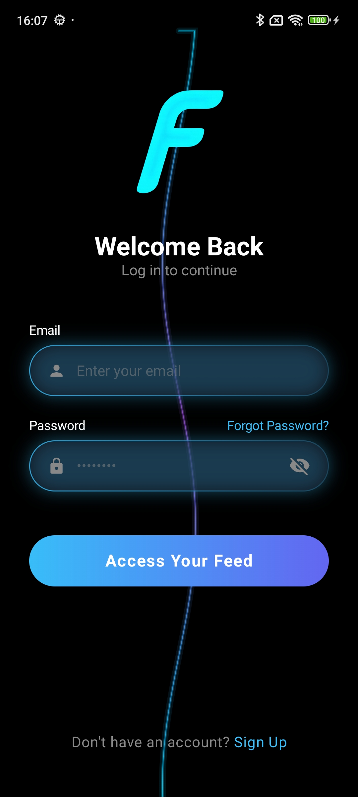
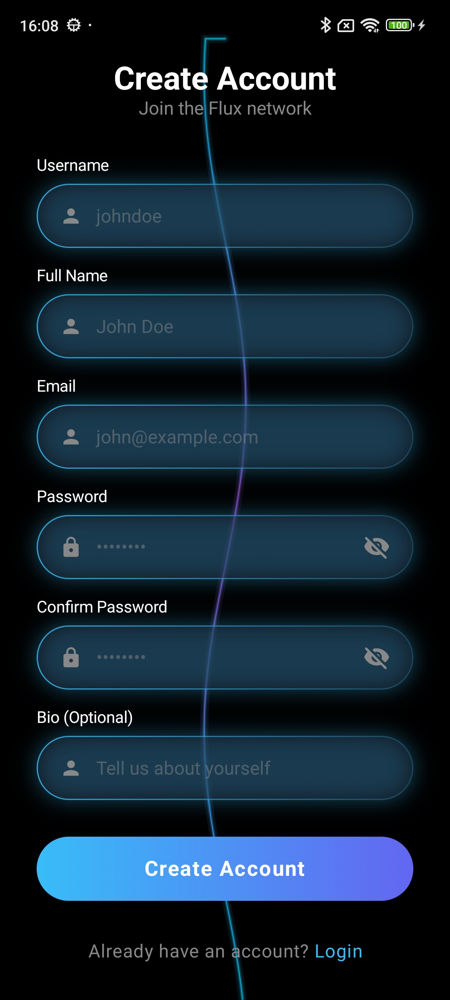
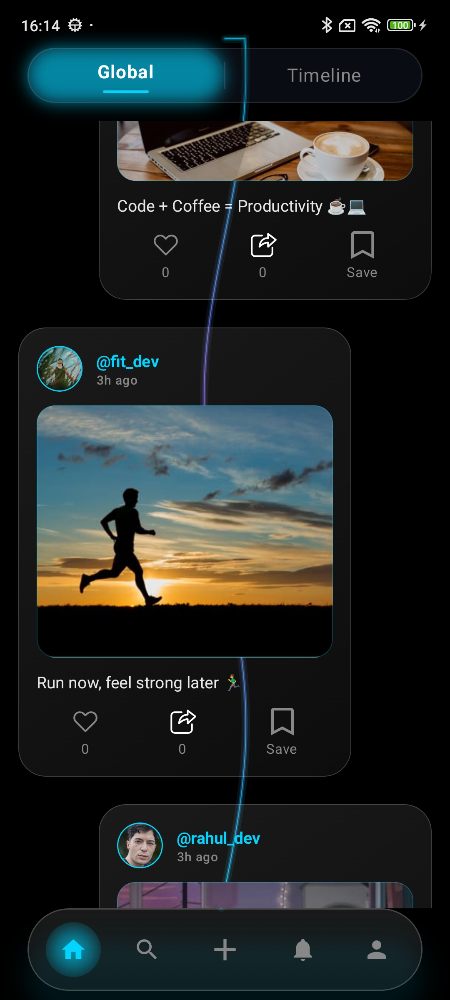
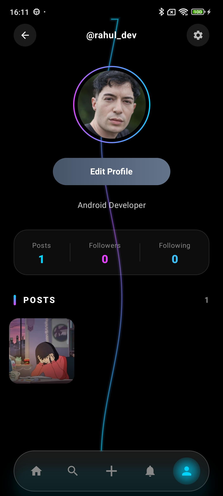
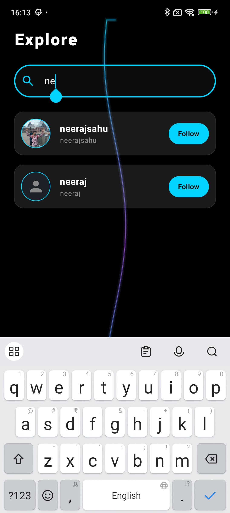
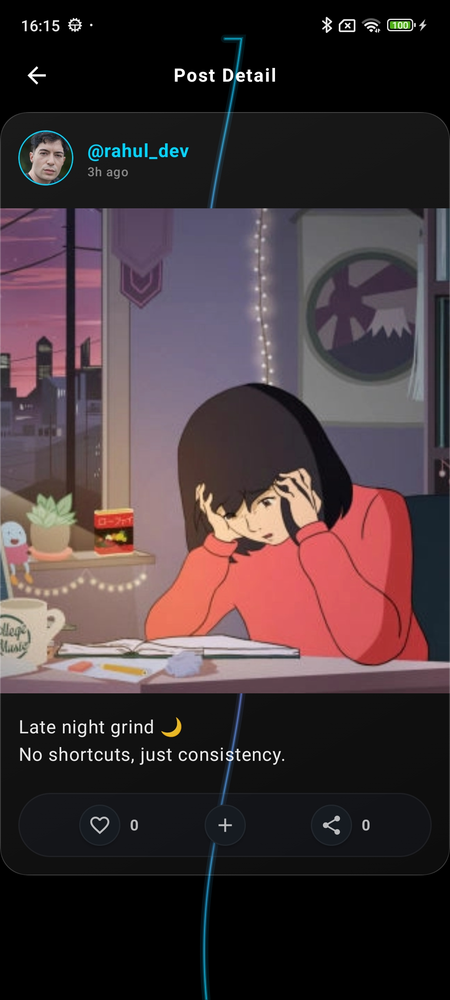
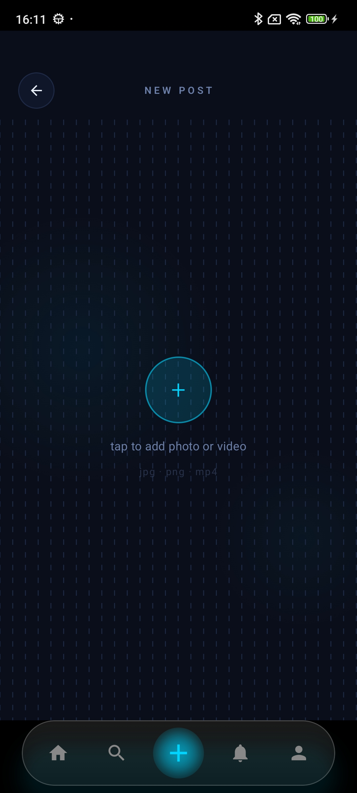
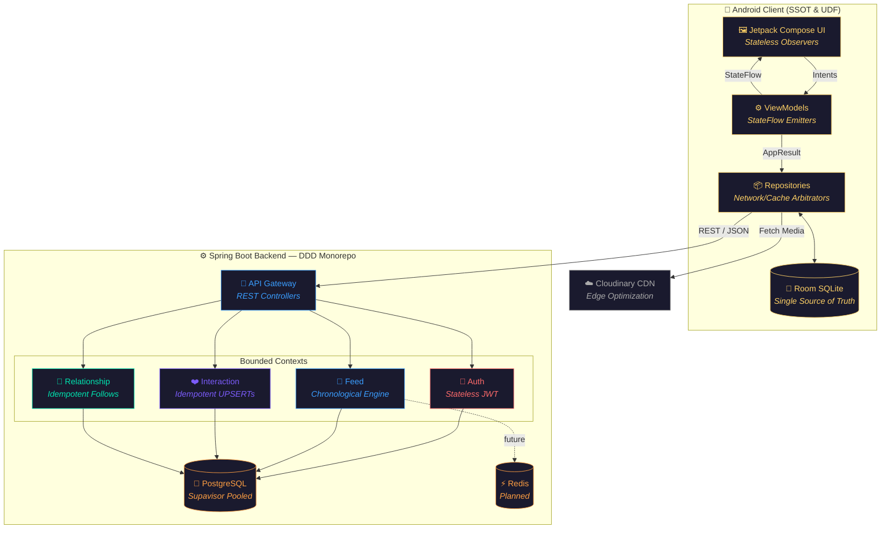
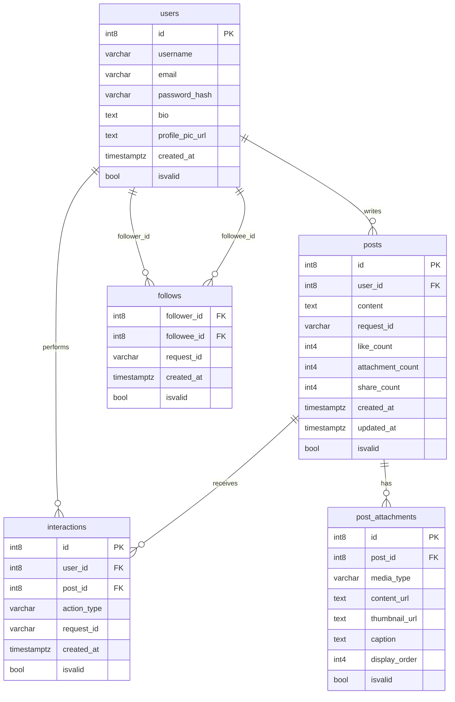
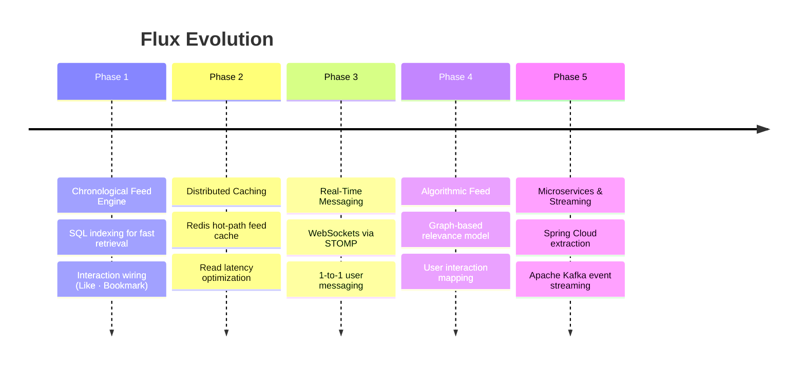

# ⚡ Flux — Distributed Scalable Feed Engine


> A full-stack engineering case study directly applying the core architectural principles from [@manuelvicnt](https://github.com/manuelvicnt) **Manuel Vicente Vivo's "Mobile System Design Interview"**. This project demonstrates how to build a scalable, distributed news feed system by architecting around strict mobile constraints—unstable networks, battery preservation, and complex state management.

---

## 📸 App Screenshots

> **Cosmic Ambient** design system — Material 3 with custom neomorphic & glassmorphic theming

<table>
  <tr>
    <td align="center"><b>Login</b></td>
    <td align="center"><b>Sign Up</b></td>
    <td align="center"><b>Feed</b></td>
    <td align="center"><b>Profile</b></td>
  </tr>
  <tr>
    <td></td>
    <td></td>
    <td></td>
    <td></td>
  </tr>
</table>

<table>
  <tr>
    <td align="center"><b>Explore</b></td>
    <td align="center"><b>Feed Detail</b></td>
    <td align="center"><b>Create Post</b></td>
    <td align="center"><b>Create Post Preview</b></td>
  </tr>
  <tr>
    <td></td>
    <td></td>
    <td></td>
    <td></td>
  </tr>
</table>

---

## 📱 Architectural Philosophy: Designing for Mobile Constraints

The entire architecture of Flux is dictated by the mobile system design heuristics outlined in Vivo's foundational literature. Rather than treating the mobile app as a dumb terminal, the client and server are co-designed to handle high-latency environments gracefully.

### 1. The Cache-Then-Network Strategy (SSOT)
Mobile networks are inherently unreliable. To prevent blocking the UI thread waiting for HTTP responses, Flux utilizes a strict **Single Source of Truth (SSOT)** via Room SQLite. 
* The UI never observes the network directly. 
* Network calls update the local database. The Jetpack Compose UI observes the local database via Kotlin `Flow`. This ensures instant cold-starts and seamless offline rendering.

### 2. Unidirectional Data Flow (UDF)
State mutations are strictly controlled to prevent UI inconsistencies during async network retries. UI components are stateless, pushing intents to ViewModels. ViewModels process these through Repositories, mutating the SSOT, which then emits a new, immutable `StateFlow` back to the UI.

### 3. API Resiliency & Idempotency
High-frequency mobile actions (like tapping "Follow" or "Like" rapidly in a subway tunnel) cause network retries. The backend Interaction and Relationship modules are engineered with **Idempotent UPSERT logic**, ensuring that client-side OkHttp retries never result in duplicate database records or inflated interaction counts.

### 4. Edge Media Processing & Thread Starvation Prevention
To respect mobile bandwidth and client-side memory limits, heavy media processing is offloaded to Cloudinary's Edge CDN for on-the-fly thumbnail generation. On the backend, these network I/O calls are explicitly moved outside of the PostgreSQL `@Transactional` boundaries to prevent database connection pool exhaustion during concurrent mobile uploads.

---

## 📐 System Architecture

The system utilizes a Clean Architecture approach on the client to isolate the SSOT, and a Domain-Driven Design (DDD) approach on the backend to separate bounded contexts.


---

## 🗄️ Database Schema

> PostgreSQL schema spanning 4 bounded contexts — Auth, Feed, Interaction, Relationship



### Android Client
```
feature/
├── auth/               # Login · SignUp · JWT token management
│   ├── data/           #   remote (AuthApi, DTOs) · local (UserDao, UserEntity)
│   ├── domain/         #   User model · AuthRepository interface
│   └── presentation/   #   AuthViewModel · LoginScreen · SignUpScreen
│
├── feed/               # Post listing · FeedViewModel
│   ├── data/           #   FeedApi · PostDto · FeedRepositoryImpl
│   ├── domain/         #   Post model · FeedRepository interface
│   └── presentation/   #   FeedScreen · FeedViewModel
│
├── interaction/        # Like · Bookmark
│   ├── data/           #   InteractionApi · InteractionDao
│   ├── domain/         #   InteractionRepository interface
│   └── presentation/   #   InteractionBar component
│
└── relationship/       # Follow · Unfollow · Connections
    ├── data/           #   RelationshipApi · FollowDao · FollowWorker (WorkManager)
    ├── domain/         #   RelationshipUser · ProfileStats models
    └── presentation/   #   ProfileScreen · ConnectionScreen · ProfileViewModel

core/
├── database/           # FluxDatabase · Converters
├── datastore/          # TokenManager (DataStore)
├── di/                 # AppModule · NetworkModule (Hilt)
├── navigation/         # Routes
├── network/            # AuthInterceptor · Result sealed class
└── ui/theme/           # Color · Type · Theme (Cosmic Ambient)
```

### Spring Boot Backend
```
server/
├── auth/               # AuthController · AuthService · JWT filter
├── feed/               # FeedController · FeedService · Post + PostAttachment
├── interaction/        # InteractionController · InteractionService · InteractionHelper
├── relationship/       # RelationshipController · FollowService · Follows model
└── config/             # SecurityConfig · CloudinaryConfig · JwtAuthFilter
```

---

## 🛠 Tech Stack

### 📱 Android Client

| Layer | Technology |
|---|---|
| Language | Kotlin |
| UI | Jetpack Compose · Material 3 · Custom Neomorphic Theme |
| Architecture | Clean Architecture · MVI/MVVM · SSOT |
| Concurrency | Kotlin Coroutines · Flow |
| Local DB | Room Database |
| Networking | Retrofit · OkHttp |
| Background | WorkManager (pending follow sync) |
| DI | Hilt |

### ⚙️ Backend

| Layer | Technology |
|---|---|
| Language | Kotlin |
| Framework | Spring Boot |
| Architecture | Domain-Driven Design (DDD) — 4 bounded contexts |
| Database | PostgreSQL |
| Media | Cloudinary (upload pipeline + CDN transforms) |
| Auth / Push | Firebase Auth · Firebase Cloud Messaging (FCM) |
| Cache | Redis *(planned)* |

---

## 📊 Project Status

### Complited

- [x] **Core DDD Architecture** — Monorepo with isolated modules (`auth`, `feed`, `interaction`, `relationship`)
- [x] **Client Theming** — "Cosmic Ambient" custom design system using Material 3
- [x] **Relationship Module** — Follow/Unfollow with backend idempotency + WorkManager sync
- [x] **Offline-First Profile** — `ProfileRepository` with Room DB caching + network fallback
- [x] **Cloudinary Integration** — Backend media upload pipeline + edge thumbnail generation
- [x] **UI Screens** — Login, Dynamic Profile (View/Edit modes), Connections List
- [x] **Feed Home Page UI** — "Fluid Timeline" with asymmetric visual clusters for the main feed
- [x] **Interaction Wiring** — Connect Like/Bookmark from UI to the backend interaction module
- [x] **Chronological Feed Engine** — SQL-based feed generation with proper DB indexing

### Remaining
- [ ] **XML Based caption** - Editing and preview
---

## 🚀 Future Roadmap



---

## 🤝 Contributing

This is an engineering case study focused on applying mobile system design concepts. Issues and PRs are welcome for discussion of architectural decisions, scaling strategies, and optimizations.

---

*Developed by [@neerajsahu14](https://github.com/neerajsahu14)*
